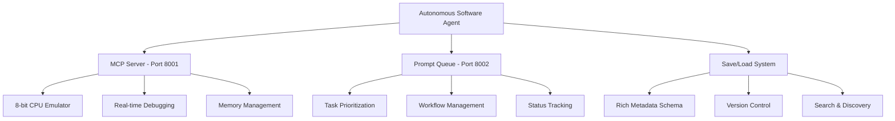

# iMaCoMpUtERussy - Autonomous Coding Agent

*Created by Kyle Durepos*

**The legendary iMaCoMpUtERussy** - the complete autonomous coding agent system that integrates AI-driven software generation with a full retro 8-bit CPU emulator. Experience computing as it never was, but always should have been through the power of autonomous software generation. 🕹️✨🤖

## 🚀 **Autonomous Capabilities**
- **Natural Language Programming**: Describe what you want in plain English, get working assembly code
- **24/7 Continuous Processing**: Autonomous agent runs non-stop, processing queued tasks when available
- **AI-Powered Debugging**: Intelligent error detection, analysis, and automated fix suggestions
- **Multi-Pipeline Workflows**: Generation → Testing → Optimization → Debugging all automated
- **Learning & Self-Improvement**: Agent continuously improves based on success/failure patterns
- **Real-Time Code Execution**: Generated programs assemble, load, and execute immediately on emulator
- **Interactive Development**: Step through code, inspect memory, set breakpoints in real-time
- **Professional-Grade Quality**: Comprehensive testing, performance optimization, and documentation

## 🖼️ See the System in Action


*The legendary iMaCoMpUtERussy running autonomous code generation - AI creates assembly programs in real-time, executes them on the 8-bit emulator, provides interactive debugging, and continuous optimization.*

## 🏗️ **System Architecture**

### Core Components Overview



### **1. MCP Server Integration** (Port 8001)
The Model Context Protocol server enables AI agents to interact with the 8-bit emulator programmatically:

- **AI Client Library**: Seamless integration with natural language processing
- **Assembly Compilation**: Real-time code generation and validation
- **Interactive Debugging**: Step-by-step execution with breakpoint management
- **Memory Inspection**: Live memory dumps and register monitoring
- **Terminal I/O**: Bidirectional communication with running programs
- **Video Graphics**: Real-time pixel manipulation and display updates
- **Program Management**: Comprehensive save/load with rich metadata

### **2. Prompt Queue System** (Port 8002)
Robust task management for autonomous workflows:

- **Task Prioritization**: Smart ordering based on priority levels (high/normal/low)
- **Persistent Storage**: File-based persistence with atomic operations and backups
- **RESTful API**: Complete endpoints for queue management and monitoring
- **Batch Processing**: Handle multiple tasks efficiently
- **Status Tracking**: Real-time task lifecycle monitoring
- **Error Recovery**: Built-in retry mechanisms and error handling
- **Web Interface**: Monitor queue status and manage tasks through browser

### **3. Autonomous Software Agent**
Intelligent multi-pipeline system for software generation:

- **Natural Language Processing**: Convert English descriptions to technical specifications
- **Multi-Pipeline Architecture**: Generation → Testing → Debugging → Optimization
- **Task Classification**: Automatic categorization of user requests
- **AI-Optimized Workflows**: Designed for AI agents with comprehensive error handling
- **Learning System**: Continuous improvement through pattern recognition
- **Concurrent Processing**: Handle multiple tasks simultaneously with smart queuing
- **Performance Monitoring**: Real-time metrics and optimization suggestions

### **4. Save/Load System Architecture**
Enterprise-grade program persistence with 50+ metadata fields:

- **Rich Metadata Schema**: Comprehensive program analysis and tracking
- **Semantic Versioning**: Full SemVer support with lineage and compatibility tracking
- **Advanced Search Engine**: Multi-dimensional search with AI-powered relevance
- **Tiered Storage**: Generated → Optimized → Tested → Archived workflow
- **Quality Metrics**: AI-computed quality scores and performance analytics
- **Usage Statistics**: Popularity tracking and user engagement metrics
- **Educational Content**: Automated generation of learning materials

### **5. Integration Testing Framework**
End-to-end validation of AI-emulator interactions:

- **MCP Client ↔ Server**: Complete API validation and error handling
- **End-to-End Workflows**: Natural language → Assembly → Execution → Testing
- **Performance Benchmarking**: Load testing and throughput analysis
- **Error Recovery Testing**: Resilience validation and failure scenarios
- **Health Monitoring**: System status and metric collection
- **CI/CD Integration**: Automated testing in deployment pipelines

## 📋 **Quick Start**

### Prerequisites
- **Node.js 22+**: For running the autonomous system
- **Modern Browser**: Chrome 94+, Firefox 85+, or Safari 14+
- **4GB RAM**: Recommended for concurrent processing
- **Git**: For repository management

### Start the Complete Autonomous System

```bash
# 1. Clone and setup
git clone https://github.com/kyle-durepos/imacomputerussy
cd imacomputerussy

# 2. Install dependencies
npm install

# 3. Start autonomous system (all components)
npm run autonomous-system-start

# Components will start on:
# - Main UI: http://localhost:8000
# - MCP Server: http://localhost:8001
# - Queue Server: http://localhost:8002
```

### Basic Usage Examples

```bash
# Add a generation task
curl -X POST http://localhost:8002/queue/add \
  -H "Content-Type: application/json" \
  -d '{
    "prompt": "Create a hello world program that displays a message",
    "type": "generation",
    "priority": "high"
  }'

# Monitor queue status
curl http://localhost:8002/queue/stats

# Get system health
curl http://localhost:8001/mcp/health

# Generate code from natural language
curl -X POST http://localhost:8001/mcp/programs/generate \
  -H "Content-Type: application/json" \
  -d '{
    "prompt": "Write an assembly program that counts from 1 to 10",
    "optimize": true,
    "test": true
  }'
```

## 🎯 **Usage Examples**

### Queue Management

```bash
# Add multiple tasks for autonomous processing
curl -X POST http://localhost:8002/queue/batch \
  -H "Content-Type: application/json" \
  -d '{
    "prompts": [
      {
        "prompt": "Create a calculator program",
        "type": "generation",
        "priority": "high"
      },
      {
        "prompt": "Test the calculator for edge cases",
        "type": "testing",
        "priority": "normal"
      }
    ]
  }'

# Monitor active tasks
curl http://localhost:8002/queue/list?status=processing

# Clean up completed tasks
curl -X POST http://localhost:8002/queue/clean
```

### Autonomous Code Generation

```bash
# Advanced generation with constraints
curl -X POST http://localhost:8001/mcp/programs/generate \
  -H "Content-Type: application/json" \
  -d '{
    "prompt": "Create a graphics demo with animated patterns",
    "requirements": {
      "max_instructions": 100,
      "use_video": true,
      "optimize_speed": true
    },
    "test_cases": [
      "should display animated pattern",
      "should run for at least 30 seconds",
      "should use less than 64 bytes memory"
    ]
  }'
```

### Interactive Debugging

```javascript
// Use the MCP client library for debugging
import { MCPClient } from './lib/mcp-client.js';

const client = new MCPClient('http://localhost:8001');

// Load and debug a program
const program = await client.loadProgram('my-program');
await client.resetCPU();

// Set breakpoints and trace
await client.setBreakpoint(0x0605);
const trace = await client.traceExecution(20);

// Inspect memory and registers
const memory = await client.inspectMemory(0x0000, 64);
const registers = await client.getCPUState();
```

### Program Library Management

```bash
# Search programs with advanced criteria
curl "http://localhost:8001/mcp/programs/search?q=calculator&complexity=intermediate&quality_min=7"

# Get program with full metadata
curl http://localhost:8001/mcp/programs/my-program/metadata

# Compare program versions
curl http://localhost:8001/mcp/programs/my-program/compare?v1=v1.0.0&v2=v1.1.0

# Update program tags
curl -X PUT http://localhost:8001/mcp/programs/my-program/tags \
  -H "Content-Type: application/json" \
  -d '{
    "tags": ["math", "calculator", "tested"],
    "operation": "add"
  }'
```

## 📚 **API Reference**

### MCP Server Endpoints (Port 8001)

#### CPU Control
```bash
POST   /mcp/cpu/reset          # Reset CPU state
GET    /mcp/cpu/state          # Get CPU registers and flags
POST   /mcp/cpu/step           # Execute single instruction
POST   /mcp/cpu/run            # Run for multiple steps
```

#### Memory Management
```bash
POST   /mcp/memory/write       # Write data to memory
GET    /mcp/memory/read        # Read data from memory
POST   /mcp/memory/load        # Load program to memory
GET    /mcp/memory/inspect     # Inspect memory region
```

#### Assembly Operations
```bash
POST   /mcp/assemble/source    # Assemble source code
POST   /mcp/assemble/run       # Assemble and execute
POST   /mcp/assemble/generate  # Natural language → Assembly
```

#### Program Management
```bash
POST   /mcp/programs/save      # Save program with metadata
GET    /mcp/programs/load      # Load program
GET    /mcp/programs/list      # List all programs
GET    /mcp/programs/search    # Search programs
DELETE /mcp/programs/{id}      # Delete program
PUT    /mcp/programs/{id}/version # Create new version
```

#### Terminal I/O
```bash
POST   /mcp/terminal/write     # Send data to program
GET    /mcp/terminal/read      # Read program output
POST   /mcp/terminal/clear     # Clear terminal
```

#### Video Graphics
```bash
POST   /mcp/video/pixel        # Set single pixel
POST   /mcp/video/update       # Refresh display
POST   /mcp/video/clear        # Clear screen
GET    /mcp/video/state        # Get video buffer
```

#### Debugging
```bash
POST   /mcp/debug/breakpoint   # Set breakpoint
POST   /mcp/debug/trace        # Trace execution
GET    /mcp/debug/memory       # Memory dump
GET    /mcp/debug/callstack    # Function call stack
```

### Queue Server Endpoints (Port 8002)

#### Task Management
```bash
POST   /queue/add              # Add new task
GET    /queue/next             # Get next task
PUT    /queue/{id}             # Update task status
DELETE /queue/{id}             # Remove task
```

#### Queue Operations
```bash
GET    /queue/list             # List tasks with filtering
GET    /queue/stats            # Get statistics
POST   /queue/clean            # Clean completed tasks
POST   /queue/batch            # Add multiple tasks
POST   /queue/process/{prefix} # Process by prefix
```

#### Backup & Recovery
```bash
POST   /queue/backup           # Create backup
GET    /queue/backups          # List backups
POST   /queue/restore          # Restore from backup
```

### Agent Configuration

```javascript
const agent = new AutonomousSoftwareAgent({
  mcpServerUrl: 'http://localhost:8001',
  processingInterval: 2000,           // Check queue every 2s
  maxRetries: 3,                      // Retry failed tasks 3x
  learningEnabled: true,              // Enable self-improvement
  autoRecovery: true,                 // Auto-recover from failures
  maxConcurrentTasks: 1,              // Process one task at a time
  learningModelPath: 'data/agent-learning.json'
});
```

## 🔧 **Advanced Configuration**

### Agent Behavior Settings

```javascript
// Configure learning parameters
const learningConfig = {
  patternRecognition: true,
  successPatternMemory: 100,
  failurePatternMemory: 50,
  optimizationThreshold: 0.7,
  learningRate: 0.1
};

// Configure autonomous workflows
const workflowConfig = {
  generation: {
    maxAttempts: 3,
    optimizationEnabled: true,
    testingRequired: true
  },
  debugging: {
    breakpointDensity: 0.1,
    traceDepth: 50,
    autoFix: true
  },
  testing: {
    coverageTarget: 0.8,
    timeoutMs: 30000,
    retries: 2
  }
};
```

### Queue Management Options

```javascript
const queueConfig = {
  priorityWeighting: {
    high: 3,
    normal: 2,
    low: 1
  },
  batchSize: 10,
  maxQueueSize: 1000,
  autoCleanup: {
    enabled: true,
    maxAgeHours: 24
  },
  persistence: {
    backupIntervalMinutes: 15,
    maxBackups: 10
  }
};
```

### Storage and Persistence

```javascript
const storageConfig = {
  baseDirectory: 'data',
  tieredStorage: {
    generated: 'programs/generated',
    optimized: 'programs/optimized',
    tested: 'programs/tested',
    archived: 'programs/archived'
  },
  metadataStorage: {
    indexFile: 'metadata/index.json',
    searchIndex: 'metadata/search-index.json'
  },
  compression: {
    enabled: true,
    algorithm: 'gzip',
    level: 6
  }
};
```

## 🤝 **Integration Guide**

### External API Usage

```javascript
// Integrate with external services
import { ExternalService } from './external-api.js';

// Program generation with external validation
const result = await client.generateWithValidation({
  prompt: "Create API client program",
  externalValidator: ExternalService.validateProgram,
  externalTester: ExternalService.testProgram
});
```

### CI/CD Integration

```yaml
# .github/workflows/autonomous-testing.yml
name: Autonomous System Testing
on: [push, pull_request]

jobs:
  test:
    runs-on: ubuntu-latest
    steps:
      - uses: actions/checkout@v2
      - uses: actions/setup-node@v2
        with:
          node-version: '22'
      - run: npm ci
      - run: npm run autonomous-system-start &
      - run: npm run integration-tests
      - run: npm run performance-tests
```

### Monitoring and Metrics

```javascript
// Collect system metrics
const metrics = await collectSystemMetrics();
console.log(`
System Status:
- Agent Processing: ${metrics.agent.active ? 'Active' : 'Inactive'}
- Queue Size: ${metrics.queue.size}
- MCP Server: ${metrics.mcp.responsive ? 'OK' : 'ERROR'}
- Last Activity: ${metrics.lastActivity}
- Error Rate: ${metrics.errorRate}%
`);
```

## ❓ **Troubleshooting FAQ**

### Q: Agent not processing tasks correctly

**Check queue status:**
```bash
curl http://localhost:8002/queue/stats
```

**Verify MCP server connection:**
```bash
curl http://localhost:8001/mcp/health
```

**Common solutions:**
- Restart autonomous agent with `npm run agent-restart`
- Check agent logs for error messages
- Verify task format matches expected schema
- Ensure MCP server has sufficient memory allocation

### Q: Generated programs fail to assemble

**Check assembly errors:**
```bash
curl http://localhost:8001/mcp/assemble/source \
  -X POST \
  -H "Content-Type: application/json" \
  -d '{"source": "your-assembly-code"}'
```

**Common causes:**
- Invalid 6502 instruction syntax
- Undefined labels not properly declared
- Memory address conflicts
- Missing instruction operands

### Q: Queue server not starting

**Check port availability:**
```bash
lsof -i :8002
```

**Common fixes:**
- Kill conflicting processes: `kill -9 $(lsof -t -i :8002)`
- Change port in configuration if needed
- Check firewall settings

### Q: Memory issues during processing

**Monitor memory usage:**
```bash
curl http://localhost:8001/mcp/debug/memory
```

**Optimization steps:**
- Reduce batch sizes in queue configuration
- Enable memory compression in storage config
- Increase server memory allocation
- Implement task timeouts

### Q: Slow performance during testing

**Check performance metrics:**
```bash
npm run performance-test
```

**Optimization options:**
- Enable caching in MCP server configuration
- Reduce trace depth in debugging config
- Use batch processing for multiple tasks
- Implement parallel testing where possible

### Q: Search not finding expected programs

**Update search index:**
```bash
curl -X POST http://localhost:8001/mcp/programs/reindex
```

**Verify search syntax:**
- Use quotes for exact matches
- Try partial words for fuzzy matching
- Check metadata fields for advanced queries

## 🔗 **Additional Resources**

### Core Documentation
- **[MCP Server API](docs/MCP_API_DOCS.md)** - Complete endpoint reference
- **[Queue Management](README_PROMPT_QUEUE.md)** - Detailed queue operations
- **[Save/Load System](docs/SAVE_LOAD_SYSTEM_ARCHITECTURE.md)** - Advanced persistence
- **[Integration Tests](integration/README.md)** - Testing framework

### Development Resources
- **[Quick Start Guide](docs/QUICK_START.md)** - Step-by-step setup
- **[Deployment Guide](docs/SETUP_DEPLOYMENT.md)** - Production deployment
- **[Troubleshooting](docs/TROUBLESHOOTING.md)** - Common issues and solutions

### Sample Programs
```bash
# Load sample programs
curl http://localhost:8001/mcp/programs/samples

# View sample categories
curl http://localhost:8001/mcp/programs/samples/categories
```

## 🎮 **Interactive Features**

### Real-Time Development Environment

The autonomous system provides a complete development workflow:

1. **Natural Language Input** → Convert English descriptions to technical specifications
2. **Automated Code Generation** → AI creates optimized assembly programs
3. **Immediate Testing** → Programs execute directly on the 8-bit emulator
4. **Interactive Debugging** → Step through code, inspect memory, set breakpoints
5. **Performance Optimization** → Automatic code improvements and optimization
6. **Quality Assurance** → Comprehensive testing and validation
7. **Version Management** → Semantic versioning with lineage tracking

### Memory-Mapped Programming

Learn assembly through practical examples:

```assembly
.org $0600
; Interactive Terminal Program
terminal_loop:
    LDA $F2        ; Check input status
    AND #$01       ; Test ready bit
    BEQ terminal_loop

    LDA $F0        ; Read input character
    STA $F1        ; Echo to output
    JMP terminal_loop
```

This system transforms assembly programming from a theoretical exercise into an interactive, AI-assisted experience.

## 📈 **Performance & Scaling**

### System Requirements

**Minimum:**
- CPU: 2 cores
- RAM: 4GB
- Storage: 1GB free space

**Recommended:**
- CPU: 4+ cores
- RAM: 8GB+
- Storage: SSD with 5GB+ free space

### Capacity Guidelines

| Operation | Typical Performance | Notes |
|-----------|-------------------|--------|
| Task Processing | 5-15 seconds | Depends on complexity |
| Code Generation | 2-10 seconds | AI processing time |
| Assembly & Execution | < 1 second | Emulator performance |
| Program Search | < 100ms | Indexed metadata search |

### Monitoring Dashboard

```bash
# System health and metrics
curl http://localhost:8001/mcp/health
curl http://localhost:8002/queue/stats

# Performance profiling
npm run performance-profile

# Resource usage monitoring
top -p $(pgrep -f "autonomous-system")
```

## 💻 **Development**

### Technology Stack
- **Frontend**: HTML5, CSS3, ES6+ JavaScript
- **Backend**: Node.js 22+ with ES modules
- **Architecture**: Event-driven, microservice design
- **APIs**: RESTful endpoints with JSON Schema validation
- **Storage**: File-based persistence with atomic operations
- **Testing**: Jest with custom assertions and coverage reporting

### Browser Compatibility
- ✅ **Chrome 94+** - Full feature set including video processing
- ✅ **Firefox 85+** - Complete functionality
- ✅ **Safari 14+** - Basic features with some limitations
- ✅ **Edge 94+** - Equivalent to Chrome/Chromium

### Contributing Guidelines
1. **Fork and clone** the repository
2. **Create feature branches** with descriptive names
3. **Add comprehensive tests** for new functionality
4. **Update documentation** including README updates
5. **Follow existing code style** and patterns
6. **Test in multiple browsers** before submission

## 📊 **System Status**

**iMaCoMpUtERussy Autonomous Coding Agent v2.1.0** ✅ **Production Ready**

This comprehensive system has evolved beyond a retro emulator into a full autonomous software generation platform:

### Phase 1: Foundation ✅
- Complete 8-bit CPU emulator with authentic 6502 instruction set
- Real-time debugging and memory inspection capabilities
- Terminal I/O and video graphics display system

### Phase 2: MCP Server ✅
- Model Context Protocol implementation for AI integration
- 18 RESTful endpoints covering all emulator functions
- Comprehensive API documentation and schema validation

### Phase 3: Autonomous Agent ✅
- Multi-pipeline workflows: Generation → Testing → Optimization → Debugging
- Natural language processing for task understanding
- Learning system with pattern recognition and self-improvement
- Concurrent task processing with intelligent queuing

### Phase 4: Advanced Features ✅
- Rich metadata schema with 50+ fields for program analysis
- Semantic versioning and lineage tracking
- Advanced search and filtering capabilities
- Tiered storage architecture (Generated/Optimized/Tested/Archived)
- Web management interface for program library

### Phase 5: Production Quality ✅
- Comprehensive integration testing framework
- Production-hardened with error recovery and monitoring
- CI/CD integration ready with performance benchmarking
- Complete documentation and troubleshooting guides

## 🚀 **Ready to Get Started?**

This autonomous coding agent system transforms how you think about programming. Instead of struggling with assembly syntax, describe what you want in plain English and watch as AI creates, tests, and optimizes your programs in real-time.

**Start exploring:**
1. [Quick Start Guide](docs/QUICK_START.md) - Get running in minutes
2. [MCP Server Documentation](docs/MCP_API_DOCS.md) - Understand the API
3. [Integration Examples](docs/MCP_API_EXAMPLES.md) - Real-world usage patterns

---

**Built with ❤️ and autonomous intelligence by Kyle Durepos**

**System ready for autonomous code generation!** 🤖🎯✨