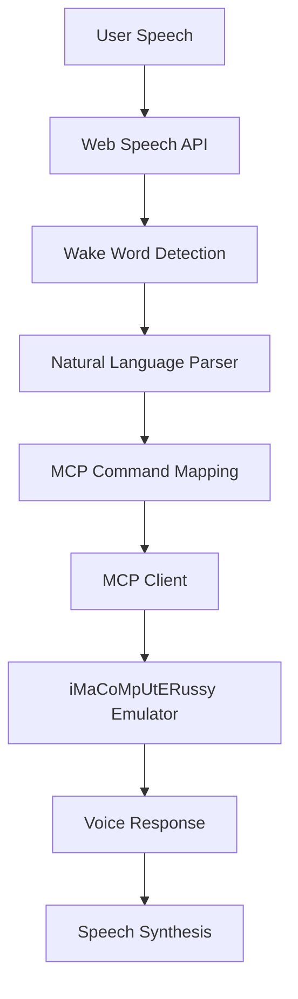

# 🎤 Voice Control for iMaCoMpUtERussy MCP Console

Complete voice control implementation enabling hands-free programming and emulator control through natural language commands integrated with the MCP server.

## 🚀 Quick Start

1. **Open the emulator**: Launch `index.html` in a modern browser
2. **Click the "Start Voice Control" button** in the top-right corner
3. **Activate with wake word**: Say **"computer"** followed by commands
4. **Try commands**: "reset CPU", "run CPU for 10 steps", "assemble code"

## 🎯 Features

### ✅ Core Features Implemented
- **Web Speech API Integration** - Real-time voice recognition
- **Wake Word Detection** - Say "computer" to activate
- **MCP Server Integration** - Direct control of emulator via voice
- **Natural Language Parsing** - Understand natural language commands
- **Voice Synthesis Feedback** - Audio responses for all actions
- **Visual Status Indicators** - Real-time UI feedback
- **Help System** - Voice-activated command assistance
- **Error Handling** - Graceful handling of recognition failures

### 🎙️ Supported Voice Commands

#### CPU Control
- `"computer step CPU"` - Execute one instruction
- `"computer reset CPU"` - Reset CPU to initial state
- `"computer run CPU for 10 steps"` - Execute multiple instructions
- `"computer CPU status"` - Get current CPU state

#### Memory Operations
- `"computer read memory at address 600"` - Read memory location
- `"computer write 42 to memory address 600"` - Write to memory
- `"computer memory dump"` - Inspect memory regions

#### Assembly & Programming
- `"computer compile code"` - Assemble current program
- `"computer load fibonacci program"` - Load sample programs
- `"computer generate code to add two numbers"` - AI code generation
- `"computer list programs"` - Show available programs

#### Terminal & Display
- `"computer clear terminal"` - Clear terminal output
- `"computer update display"` - Refresh video display
- `"computer set pixel 5 10 to 255"` - Set video pixels

#### Help & Control
- `"computer help"` - Show available commands
- `"computer stop voice control"` - Deactivate voice control

## 🏗️ Technical Implementation

### Files Added/Modified
- `js/ui/voice-control.js` - Main voice control system (719 lines)
- `index.html` - Updated with voice control UI and imports
- Voice control panel with CSS styling for retro aesthetic

### Architecture


### Key Components

1. **VoiceControlSystem Class**
   - Manages speech recognition and synthesis
   - Handles wake word detection
   - Processes natural language commands
   - Provides visual feedback

2. **MCP Integration**
   - Uses existing MCP client library
   - Maps voice commands to API endpoints
   - Handles MCP responses and errors

3. **Natural Language Processing**
   - Pattern matching for command recognition
   - Parameter extraction from speech
   - Fallback for unknown commands

4. **Visual Feedback System**
   - Status indicators (listening, processing, speaking, error)
   - Audio level visualization
   - Terminal-style logging
   - Help overlay system

## 🛠️ Configuration

### Browser Requirements
- Modern browser with Web Speech API support
- Microphone permissions (granted automatically)
- HTTPS connection (recommended for production)

### MCP Server Requirements
- MCP server running on port 8001
- Full API access for voice commands
- Error handling for failed requests

## 🎨 Usage Examples

### Basic Workflow
```
User: "computer reset CPU"
→ Voice Control: CPU has been reset successfully

User: "computer load fibonacciprogram"
→ Voice Control: Loading fibonacci program

User: "computer run CPU"
→ Voice Control: CPU running 10 steps

User: "computer memory dump"
→ Voice Control: Inspecting memory region
```

### Advanced Commands
```
User: "computer generate code to display hello world"
→ Voice Control: Generating code to display hello world

User: "computer write 255 to memory address F0"
→ Voice Control: Writing 255 to address 0xF0

User: "computer set pixel 0 0 to 1"
→ Voice Control: Setting pixel at (0, 0) to color 1
```

## 🎤 Voice Control States

### Visual Indicators
- **🎙️ Ready** - Voice control inactive
- **🎙️ Listening** - Actively listening for wake word
- **🎙️ Wake word detected** - Processing commands
- **🎙️ Processing** - Executing command via MCP
- **🔊 Speaking** - Providing audio feedback

### Status Messages
- **Idle**: Voice control inactive
- **Error**: Recognition or execution error
- **Success**: Command executed successfully

## 🔧 Troubleshooting

### Common Issues

1. **"Speech recognition not supported"**
   - Use Chrome, Edge, or Safari
   - Enable microphone permissions

2. **MCP server connection failed**
   ```bash
   # Start MCP server
   npm run mcp-server
   # Should be available at http://localhost:8001
   ```

3. **Wake word not detected**
   - Speak clearly and closer to microphone
   - Try "computer" followed by pause

4. **Commands not recognized**
   - Use simple, clear commands
   - Check pronunciation
   - Say "help" for available commands

### Debug Mode
- Press `Ctrl+V` for quick voice control toggle
- Check browser console for detailed logs
- MCP logs panel shows command history

## 📚 API Reference

### VoiceControlSystem Methods
```javascript
// Main control
voiceControl.initialize()      // Start voice control
voiceControl.activate()        // Enable listening
voiceControl.deactivate()      // Stop listening
voiceControl.toggleVoiceControl() // Toggle on/off

// Command processing
voiceControl.parseVoiceCommand(text) // Parse to MCP action
voiceControl.executeCommand(action)  // Execute via MCP
voiceControl.speakResponse(text)     // Audio feedback

// UI updates
voiceControl.updateStatus(state, text) // Update indicators
voiceControl.logToTerminal(message)    // Add to voice terminal
```

### MCP Command Mapping
- Voice commands → MCP endpoints → Emulator actions
- Natural language → Structured API calls
- Error handling → User-friendly voice responses

## 🎯 Future Enhancements

- **Machine Learning**: Better wake word detection
- **Custom Grammar**: Domain-specific command patterns
- **Multi-Language**: Support for additional languages
- **Voice Profiles**: User-specific voice recognition
- **Command Learning**: Adaptive command understanding
- **Audio Feedback**: Enhanced voice synthesis options

## 🤝 Integration

### With MCP Server
```javascript
// Voice commands integrate seamlessly with existing MCP endpoints:
// - CPU control: /cpu/reset, /cpu/step, /cpu/run, /cpu/state
// - Memory: /memory/read, /memory/write, /memory/loadProgram
// - Assembly: /assemble/source, /assemble/loadAndRun
// - Programs: /programs/list, /programs/load
// - Debug: /debug/trace, /debug/memoryView
// - Video: /video/update, /video/setPixel
```

### With Emulator UI
- **Panel Integration**: Voice control appears in top-right
- **Consistent Styling**: Retro terminal aesthetic
- **Non-Intrusive**: Can be minimized when not in use
- **Keyboard Shortcuts**: Ctrl+V for quick access

## 📈 Performance

### Browser Compatibility
- Chrome 25+ ✅
- Edge 79+ ✅
- Safari 14.1+ ✅
- Firefox 44+ ⚠️ (Limited support)

### System Requirements
- Microphone input ✅
- Stable internet ✅
- Modern browser ✅
- MCP server running ✅

### Resources
- CPU Usage: Minimal during idle
- Memory: ~2-5MB for voice recognition
- Network: MCP API calls only during commands

---

## 🚀 Getting Started

1. **Launch the emulator**: Open `index.html` in your browser
2. **Allow microphone access** when prompted
3. **Start MCP server**: `npm run mcp-server`
4. **Try it out**: Click "Start Voice Control" and say "computer help"

**Experience the future of hands-free programming with voice-controlled assembly development! 🎤✨**