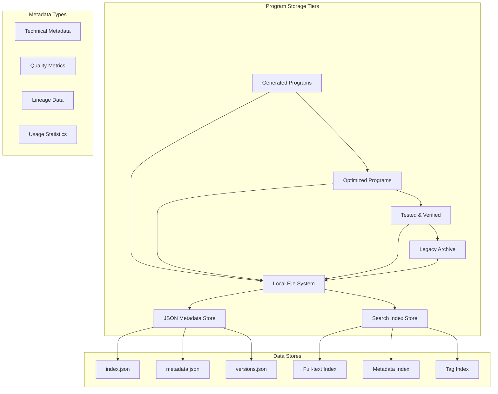
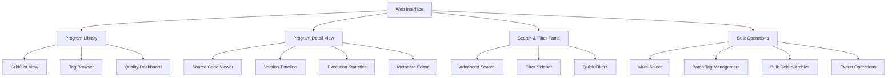
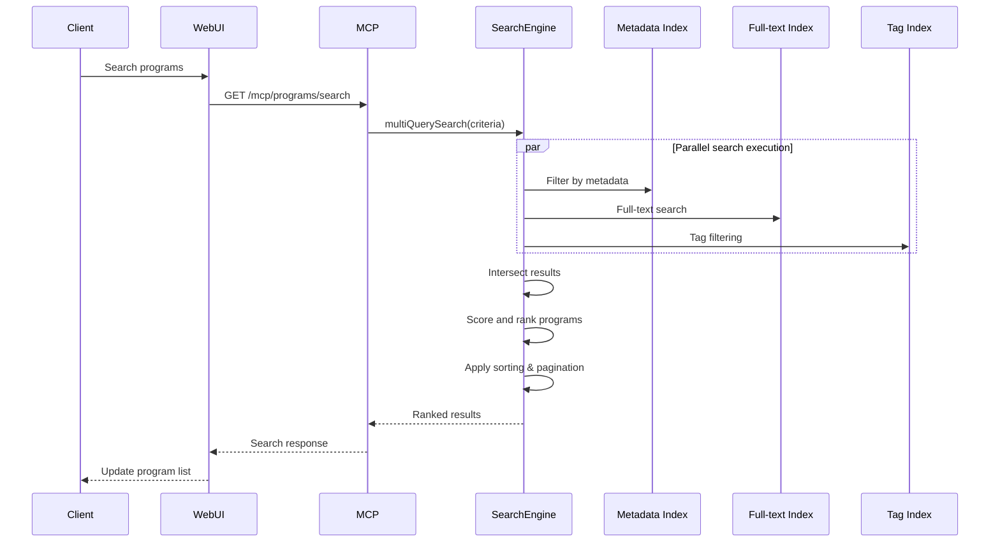

# Enhanced Program Save/Load System Architecture

## Overview

This document describes a comprehensive program persistence system for the iMaCoMpUtERussy emulator that extends the current basic file-based storage with rich metadata, versioning, search capabilities, and a web management interface.

## Current System Analysis

### Existing Architecture
- **Program Storage**: File-based in `samples/` directory (.asm files only)
- **Metadata**: Basic extraction from file comments
- **API**: Minimal MCP program management endpoints
- **Search**: None - basic file listing only
- **Versioning**: None - file overwrites without history

### Key Limitations
1. Minimal metadata tracking
2. No version control or lineage tracking
3. Limited search and filtering capabilities
4. No program categorization or quality metrics
5. Basic web interface for program management
6. No AI-generated program tracking

## Proposed Architecture

### 1. Multi-Level Storage Architecture



### 2. Enhanced Directory Structure

```
/data/
├── programs/
│   ├── generated/     # AI-generated programs
│   │   ├── basic-addition/
│   │   │   ├── v1.0.0/
│   │   │   │   ├── source.asm
│   │   │   │   ├── bytecode.json
│   │   │   │   └── debug-info.json
│   │   │   ├── v1.0.1/
│   │   │   └── v1.0.2/
│   │   └── fibonacci-sequence/
│   ├── optimized/     # Performance-optimized versions
│   │   ├── math-lib-optimized/
│   │   └── graphics-fast/
│   ├── tested/       # Fully-tested, verified programs
│   │   ├── standard-library/
│   │   └── validated-math/
│   └── archived/     # Older versions and deprecated programs
│       ├── legacy-code/
│       └── experimental/
├── metadata/
│   ├── index.json          # Program catalog
│   ├── tags.json           # Tag system
│   ├── search-index.json   # Full-text search index
│   ├── history.json        # Version history
│   └── stats.json          # Usage statistics
├── backups/               # Automatic backups
│   ├── programs-20250101.zip
│   └── metadata-20250101.zip
└── config.json           # System configuration
```

### 3. Comprehensive Metadata Schema

```json
{
  "$schema": "https://json-schema.org/draft/07/schema#",
  "type": "object",
  "required": [
    "id",
    "name",
    "source",
    "metadata"
  ],
  "properties": {
    "id": {
      "type": "string",
      "description": "Unique program identifier",
      "pattern": "^[a-zA-Z0-9_-]{8,64}$"
    },
    "name": {
      "type": "string",
      "description": "User-friendly program name",
      "maxLength": 100
    },
    "description": {
      "type": "string",
      "description": "Natural language description",
      "maxLength": 500
    },
    "source": {
      "type": "object",
      "properties": {
        "code": {
          "type": "string",
          "description": "Assembly source code",
          "maxLength": 65536
        },
        "encoding": {
          "type": "string",
          "enum": ["utf-8", "ascii"],
          "default": "utf-8"
        },
        "format": {
          "type": "string",
          "enum": ["asm", "json"],
          "default": "asm"
        }
      }
    },
    "metadata": {
      "type": "object",
      "properties": {
        "technical": {
          "type": "object",
          "properties": {
            "instructionCount": {
              "type": "integer",
              "minimum": 1,
              "description": "Number of assembly instructions"
            },
            "bytecodeSize": {
              "type": "integer",
              "minimum": 1,
              "description": "Compiled bytecode size in bytes"
            },
            "memoryUsage": {
              "type": "integer",
              "description": "Memory footprint estimate in bytes"
            },
            "executionCycles": {
              "type": "integer",
              "description": "Estimated CPU cycles for execution"
            },
            "stackUsage": {
              "type": "integer",
              "minimum": 0,
              "description": "Stack usage in bytes"
            },
            "zeroPageUsage": {
              "type": "integer",
              "minimum": 0,
              "description": "Zero page memory usage"
            }
          }
        },
        "quality": {
          "type": "object",
          "properties": {
            "complexity": {
              "type": "string",
              "enum": ["beginner", "intermediate", "advanced", "expert"]
            },
            "quality_score": {
              "type": "number",
              "minimum": 0.0,
              "maximum": 10.0,
              "description": "AI-computed quality score"
            },
            "test_coverage": {
              "type": "number",
              "minimum": 0.0,
              "maximum": 1.0,
              "description": "Test coverage percentage"
            },
            "error_rate": {
              "type": "number",
              "minimum": 0.0,
              "maximum": 1.0,
              "description": "Runtime error rate"
            },
            "successful_runs": {
              "type": "integer",
              "minimum": 0,
              "description": "Number of successful executions"
            },
            "average_execution_time": {
              "type": "number",
              "description": "Average execution time in milliseconds"
            }
          }
        },
        "generation": {
          "type": "object",
          "properties": {
            "model_version": {
              "type": "string",
              "description": "AI model used for generation"
            },
            "generation_time": {
              "type": "string",
              "format": "date-time",
              "description": "When program was generated"
            },
            "processing_duration": {
              "type": "number",
              "description": "Generation time in milliseconds"
            },
            "attempt_count": {
              "type": "integer",
              "minimum": 1,
              "description": "Number of generation attempts"
            },
            "error_fixes": {
              "type": "array",
              "items": {
                "type": "string"
              },
              "description": "Types of errors that were fixed"
            }
          }
        },
        "lineage": {
          "type": "object",
          "properties": {
            "parent_id": {
              "type": "string",
              "description": "Parent program ID"
            },
            "children": {
              "type": "array",
              "items": {
                "type": "string"
              },
              "description": "Child program IDs"
            },
            "versions": {
              "type": "array",
              "items": {
                "type": "string"
              },
              "description": "All version tags for this program"
            },
            "related_programs": {
              "type": "array",
              "items": {
                "type": "string"
              },
              "description": "Related program IDs"
            }
          }
        },
        "tags": {
          "type": "array",
          "items": {
            "type": "string",
            "pattern": "^[a-zA-Z0-9_-]{2,30}$"
          },
          "maxItems": 20,
          "description": "User-defined tags for categorization"
        },
        "usage": {
          "type": "object",
          "properties": {
            "last_used": {
              "type": "string",
              "format": "date-time"
            },
            "use_count": {
              "type": "integer",
              "minimum": 0
            },
            "favorite": {
              "type": "boolean"
            },
            "rating": {
              "type": "number",
              "minimum": 1,
              "maximum": 5
            }
          }
        }
      }
    },
    "version": {
      "type": "string",
      "pattern": "^v\\d+\\.\\d+\\.\\d+(-\\w+)?$",
      "description": "Semantic version following MAJOR.MINOR.PATCH format"
    },
    "tier": {
      "type": "string",
      "enum": ["generated", "optimized", "tested", "archived"],
      "description": "Storage tier classification"
    },
    "permissions": {
      "type": "object",
      "properties": {
        "is_public": {
          "type": "boolean",
          "default": true
        },
        "allow_copy": {
          "type": "boolean",
          "default": true
        },
        "allow_modify": {
          "type": "boolean",
          "default": true
        }
      }
    }
  }
}
```

### 4. Versioning Architecture

#### Semantic Versioning System
```javascript
// Version format: MAJOR.MINOR.PATCH[-LABEL]
// Examples: v1.0.0, v2.1.3, v1.2.0-beta
const versionSchema = {
  pattern: /^v\d+\.\d+\.\d+(-[a-zA-Z0-9]+)?$/,
  examples: [
    "v1.0.0",     // Initial release
    "v1.0.1",     // Bug fix
    "v1.1.0",     // Feature addition
    "v2.0.0",     // Breaking changes
    "v1.2.0-rc"   // Release candidate
  ]
};
```

#### Version Control Operations
```javascript
const VersionManager = {
  // Create new version
  createVersion: async (programId, changes, options = {}) => {
    const nextVersion = calculateNextVersion(programId, options.bumpType);
    const versionedProgram = {
      ...originalProgram,
      id: `${programId}_${nextVersion}`,
      version: nextVersion,
      lineage: {
        ...originalProgram.lineage,
        parent_id: programId,
        versions: [...originalProgram.lineage.versions, nextVersion]
      },
      metadata: {
        ...originalProgram.metadata,
        version_history: [
          ...originalProgram.metadata.version_history,
          {
            version: nextVersion,
            timestamp: new Date().toISOString(),
            changes: changes,
            author: options.author || 'system'
          }
        ]
      }
    };
    return versionedProgram;
  },

  // Compare versions
  compareVersions: async (programId, v1, v2) => {
    // Return diff, compatibility, breaking changes
  }
};
```

### 5. Advanced Search and Filtering System

#### Multi-Dimensional Search Engine
```javascript
class ProgramSearchEngine {
  constructor() {
    this.indices = {
      fulltext: new FullTextIndex(),
      metadata: new MetadataIndex(),
      tags: new TagIndex(),
      quality: new QualityIndex()
    };
  }

  // Multi-criteria search
  async search(criteria = {}) {
    const {
      query,        // Full-text search
      tags,         // Tag filtering
      complexity,   // Difficulty level filter
      quality_min,  // Minimum quality score
      date_range,   // Date range filter
      author,       // Author filter
      sortBy,       // Sort field
      limit        // Result limit
    } = criteria;

    // Execute parallel searches across indices
    const [textResults, tagResults, qualityResults] = await Promise.all([
      this.indices.fulltext.search(query),
      this.indices.tags.filter(tags),
      this.indices.quality.filter({ min: quality_min })
    ]);

    // Intersect results and apply additional filters
    const intersection = this.intersectResults(textResults, tagResults, qualityResults);

    // Apply post-filters and sorting
    return this.applyFiltersAndSort(intersection, criteria);
  }

  // Semantic search for program similarity
  async findSimilar(programId, options = {}) {
    const targetProgram = await this.getProgram(programId);
    const embedding = await this.generateEmbedding(targetProgram);

    return this.indices.vector.search(embedding, {
      threshold: options.threshold || 0.8,
      limit: options.limit || 10
    });
  }
}
```

### 6. Enhanced MCP API Extensions

#### New Endpoints

```javascript
// POST /mcp/programs/save-extended
app.post('/mcp/programs/save-extended', asyncHandler(async (req, res) => {
  const validation = validate('programs.save.extended.request', req.body);

  const {
    name,
    source,
    metadata,
    version,
    tags,
    tier
  } = req.body;

  const result = await adapter.programs.saveExtended({
    name, source, metadata, version, tags, tier
  });

  res.json(successResponse(result));
}));

// GET /mcp/programs/search
app.get('/mcp/programs/search', asyncHandler(async (req, res) => {
  const { q, tags, complexity, quality_min, limit } = req.query;

  const results = await adapter.programs.search({
    query: q,
    tags: tags ? tags.split(',') : null,
    complexity,
    quality_min: parseFloat(quality_min),
    limit: parseInt(limit) || 20
  });

  res.json(successResponse(results));
}));

// PUT /mcp/programs/{id}/version
app.put('/mcp/programs/:id/version', asyncHandler(async (req, res) => {
  const { id } = req.params;
  const { changes, bumpType } = req.body;

  const result = await adapter.programs.createVersion(id, changes, { bumpType });
  res.json(successResponse(result));
}));
```

### 7. Web Management Interface Architecture



#### Key Components

1. **Program Library Dashboard**
   - **Grid/List Toggle**: Switch between visual grid and detailed list views
   - **Tag-Based Organization**: Hierarchical tag browsing with filters
   - **Quality Metrics Dashboard**: Visual quality score distributions
   - **Activity Timeline**: Recent saves, loads, and modifications
   - **Bulk Selection**: Multi-select for batch operations

2. **Program Detail Viewer**
   - **Rich Metadata Display**: Comprehensive metadata visualization
   - **Integrated Code Editor**: Syntax-highlighted assembly editor
   - **Version History Timeline**: Interactive version browser
   - **Execution Statistics**: Run-time performance graphs
   - **Dependency Graph**: Visual program lineage display
   - **Export Options**: Multiple export formats (ASM, JSON, binary)

3. **Search and Discovery**
   - **Semantic Search**: Natural language program search
   - **Advanced Filters**: Multi-criteria filtering interface
   - **Saved Searches**: Persistent search templates
   - **Search Suggestions**: Auto-complete and recommendations

4. **Quality and Analytics**
   - **Quality Score Trends**: Historical quality improvement
   - **Usage Statistics**: Popularity and engagement metrics
   - **Performance Benchmarks**: Comparative performance analysis
   - **Error Tracking**: Failure rates and common issues

### 8. Integration Points

#### Existing System Integration

```javascript
// Extend ProgramManager class in mcp_developer_adapter.js
class EnhancedProgramManager extends ProgramManager {
  constructor() {
    super();
    this.enhancedStorage = new EnhancedStorage();
    this.searchEngine = new ProgramSearchEngine();
    this.versionManager = new VersionManager();
  }

  // Enhanced save method
  async saveExtended(options) {
    const { name, source, metadata, version, tags, tier } = options;

    // Generate ID and version
    const id = generateId();
    const programVersion = version || 'v1.0.0';

    // Create comprehensive program object
    const program = {
      id,
      name,
      source: { code: source },
      metadata: this.enrichMetadata(metadata),
      version: programVersion,
      tags: tags || [],
      tier: tier || 'generated'
    };

    // Store to multi-tier filesystem
    await this.enhancedStorage.save(program);

    // Update search indices
    await this.searchEngine.index(program);

    return program;
  }
}
```

### 9. Performance and Scalability Considerations

#### Indexing Strategy
- **Incremental Indexing**: Real-time updates for new/changed programs
- **Batch Processing**: Background indexing for bulk operations
- **Compression**: Compressed indices for large datasets
- **Caching**: Redis/in-memory caching for frequently accessed data

#### Storage Optimization
- **File Organization**: Hash-based directory structure for large collections
- **Compression**: LZ4 compression for source code and metadata
- **Deduplication**: Content-based deduplication of similar programs
- **Backup Strategy**: Automated incremental backups

#### Search Optimization
- **Inverted Index**: Fast full-text search capabilities
- **Bloom Filters**: Pre-filtering for complex queries
- **Materialized Views**: Pre-computed aggregations for common queries
- **Query Caching**: Cache frequent search patterns

### 10. Security and Access Control

#### Permission System
```javascript
const PermissionSystem = {
  levels: {
    PUBLIC: 'public',       // Visible and usable by all
## New MCP API Schemas

### 1. Enhanced Program Save Schema

```json
// POST /mcp/programs/save-extended
{
  "$schema": "https://json-schema.org/draft-07/schema#",
  "type": "object",
  "required": ["name", "source"],
  "properties": {
    "name": {
      "type": "string",
      "maxLength": 100,
      "description": "Human-readable program name"
    },
    "source": {
      "type": "object",
      "properties": {
        "code": {
          "type": "string",
          "maxLength": 65536,
          "description": "Assembly source code"
        },
        "format": {
          "type": "string",
          "enum": ["asm", "json"],
          "default": "asm"
        }
      }
    },
    "metadata": {
      "type": "object",
      "properties": {
        "description": {
          "type": "string",
          "maxLength": 500,
          "description": "Natural language description"
        },
        "tags": {
          "type": "array",
          "items": {"type": "string"},
          "maxItems": 20,
          "description": "Categorization tags"
        },
        "complexity": {
          "type": "string",
          "enum": ["beginner", "intermediate", "advanced"]
        },
        "quality_score": {
          "type": "number",
          "minimum": 0,
          "maximum": 10,
          "description": "AI-computed quality score"
        },
        "original_prompt": {
          "type": "string",
          "description": "User's original request that generated this program"
        }
      }
    },
    "version": {
      "type": "string",
      "pattern": "^v\\d+\\.\\d+\\.\\d+$",
      "description": "Semantic version (auto-generated if not provided)"
    },
    "tier": {
      "type": "string",
      "enum": ["generated", "optimized", "tested", "archived"],
      "description": "Storage tier classification"
    },
    "parent_id": {
      "type": "string",
      "description": "ID of parent program if this is a fork/variant"
    },
    "overwrite": {
      "type": "boolean",
      "default": false,
      "description": "Whether to overwrite existing program"
    }
  }
}
```

### 2. Advanced Search Request Schema

```json
// GET /mcp/programs/search
{
  "$schema": "https://json-schema.org/draft-07/schema#",
  "type": "object",
  "properties": {
    "q": {
      "type": "string",
      "description": "Full-text search query"
    },
    "tags": {
      "type": "array",
      "items": {"type": "string"},
      "description": "Filter by tags"
    },
    "complexity": {
      "type": "array",
      "items": {
        "type": "string",
        "enum": ["beginner", "intermediate", "advanced"]
      },
      "description": "Filter by difficulty level"
    },
    "quality_min": {
      "type": "number",
      "minimum": 0,
      "maximum": 10,
      "description": "Minimum quality score filter"
    },
    "tier": {
      "type": "array",
      "items": {
        "type": "string",
        "enum": ["generated", "optimized", "tested", "archived"]
      },
      "description": "Filter by storage tier"
    },
    "date_range": {
      "type": "object",
      "properties": {
        "from": {
          "type": "string",
          "format": "date"
        },
        "to": {
          "type": "string",
          "format": "date"
        }
      },
      "description": "Date range filter for creation dates"
    },
    "sort_by": {
      "type": "string",
      "enum": ["name", "quality_score", "date_created", "use_count"],
      "default": "date_created",
      "description": "Sort field"
    },
    "sort_order": {
      "type": "string",
      "enum": ["asc", "desc"],
      "default": "desc",
      "description": "Sort direction"
    },
    "limit": {
      "type": "integer",
      "minimum": 1,
      "maximum": 100,
      "default": 20,
      "description": "Maximum results to return"
    },
    "offset": {
      "type": "integer",
      "minimum": 0,
      "default": 0,
      "description": "Pagination offset"
    }
  }
}
```

### 3. Version Management Request Schema

```json
// PUT /mcp/programs/{id}/version
{
  "$schema": "https://json-schema.org/draft-07/schema#",
  "type": "object",
  "required": ["changes"],
  "properties": {
    "changes": {
      "type": "string",
      "maxLength": 500,
      "description": "Description of what changed"
    },
    "bump_type": {
      "type": "string",
      "enum": ["patch", "minor", "major"],
      "default": "patch",
      "description": "Type of version bump"
    },
    "source": {
      "type": "string",
      "description": "Updated source code (optional, inherits from parent if not provided)"
    },
    "metadata_changes": {
      "type": "object",
      "description": "Metadata updates to apply to new version"
    },
    "compatibility": {
      "type": "string",
      "enum": ["backward_compatible", "breaking_changes", "new_features"],
      "default": "backward_compatible",
      "description": "Compatibility level of this version"
    }
  }
}
```

### 4. Enhanced Program Response Schema

```json
// Response for detailed program queries
{
  "$schema": "https://json-schema.org/draft-07/schema#",
  "type": "object",
  "required": ["success"],
  "properties": {
    "success": {"type": "boolean"},
    "data": {
      "type": "object",
      "properties": {
        "id": {"type": "string"},
        "name": {"type": "string"},
        "description": {"type": "string"},
        "source": {
          "type": "object",
          "properties": {
            "code": {"type": "string"},
            "format": {"type": "string"}
          }
        },
        "version": {"type": "string"},
        "tier": {"type": "string"},
        "metadata": {
          "type": "object",
          "properties": {
            "technical": {"type": "object"},
            "quality": {"type": "object"},
            "generation": {"type": "object"},
            "usage": {"type": "object"},
            "tags": {
              "type": "array",
              "items": {"type": "string"}
            }
          }
        },
        "lineage": {
          "type": "object",
          "properties": {
            "parent_id": {"type": "string"},
            "children": {"type": "array"},
            "versions": {"type": "array"}
          }
        },
        "created_at": {"type": "string", "format": "date-time"},
        "updated_at": {"type": "string", "format": "date-time"}
      }
    }
  }
}
```

## Search and Filtering Implementation

### Multi-Dimensional Search Algorithm

```javascript
class AdvancedSearchEngine {
  constructor(programIndex, metadataIndex, tagIndex) {
    this.programIndex = programIndex;
    this.metadataIndex = metadataIndex;
    this.tagIndex = tagIndex;
  }

  async search(query) {
    const textMatches = await this.fullTextSearch(query.q);
    const tagMatches = await this.tagFilter(query.tags);
    const metadataMatches = await this.metadataFilter(query);

    // Find intersection of all result sets
    const candidateIds = this.intersectAll([
      textMatches,
      tagMatches,
      ...Object.values(metadataMatches)
    ]);

    // Apply scoring and ranking
    const scoredResults = await this.scoreAndRank(candidateIds, query);
    const sortedResults = this.sortResults(scoredResults, query.sort_by, query.sort_order);

    return this.paginateResults(sortedResults, query.offset, query.limit);
  }

  async fullTextSearch(query) {
    if (!query) return new Set(); // Return all if no query

    // Use TF-IDF or BM25-like scoring
    const terms = this.tokenizeAndNormalize(query);
    const matches = new Map();

    for (const term of terms) {
      const termMatches = await this.programIndex.searchTerm(term);
      for (const [id, score] of termMatches) {
        matches.set(id, (matches.get(id) || 0) + score);
      }
    }

    return this.rankByRelevance(matches);
  }

  async tagFilter(tagList) {
    if (!tagList || tagList.length === 0) return new Set();

    const tagSets = await Promise.all(
      tagList.map(tag => this.tagIndex.getProgramsByTag(tag))
    );

    // Programs must have ALL specified tags (AND operation)
    return tagSets.reduce((intersection, tagSet) => {
      return new Set([...intersection].filter(id => tagSet.has(id)));
    });
  }

  async metadataFilter(query) {
    const filters = {};

    if (query.complexity && query.complexity.length > 0) {
      filters.complexity = await this.metadataIndex.filterByComplexity(query.complexity);
    }

    if (query.quality_min !== undefined) {
      filters.quality = await this.metadataIndex.filterByQuality(query.quality_min);
    }

    if (query.tier && query.tier.length > 0) {
      filters.tier = await this.metadataIndex.filterByTier(query.tier);
    }

    if (query.date_range) {
      filters.date = await this.metadataIndex.filterByDateRange(query.date_range);
    }

    return filters;
  }

  intersectAll(sets) {
    if (sets.length === 0) return new Set();
    if (sets.length === 1) return sets[0];

    return sets.reduce((intersection, currentSet) => {
      return new Set([...intersection].filter(id => currentSet.has(id)));
    });
  }

  async scoreAndRank(programIds, query) {
    const scoredPrograms = [];

    for (const programId of programIds) {
      const program = await this.programIndex.getProgram(programId);
      const score = this.calculateCompositeScore(program, query);
      scoredPrograms.push({ program, score });
    }

    return scoredPrograms;
  }

  calculateCompositeScore(program, query) {
    let score = 0;

    // Quality score weighting
    if (query.quality_min !== undefined) {
      const qualityScore = program.metadata?.quality?.quality_score || 0;
      score += qualityScore * 2; // Weight quality heavily
    }

    // Usage score weighting
    const useCount = program.metadata?.usage?.use_count || 0;
    score += Math.log(useCount + 1) * 0.5;

    // Recency weighting
    const daysSinceUpdate = this.daysSince(program.updated_at);
    score += Math.max(0, (30 - daysSinceUpdate) / 30); // Favor recent programs

    return score;
  }

  sortResults(scoredResults, sortBy = 'score', sortOrder = 'desc') {
    return scoredResults.sort((a, b) => {
      const aVal = this.getSortValue(a.program, sortBy, a.score);
      const bVal = this.getSortValue(b.program, sortBy, b.score);

      if (sortOrder === 'asc') {
        return aVal - bVal;
      } else {
        return bVal - aVal;
      }
    });
  }

  getSortValue(program, sortBy, score) {
    switch (sortBy) {
      case 'score': return score;
      case 'name': return program.name.toLowerCase();
      case 'quality_score': return program.metadata?.quality?.quality_score || 0;
      case 'date_created': return new Date(program.created_at).getTime();
      case 'use_count': return program.metadata?.usage?.use_count || 0;
      default: return score;
    }
  }

  paginateResults(sortedResults, offset = 0, limit = 20) {
    return {
      data: sortedResults.slice(offset, offset + limit),
      total: sortedResults.length,
      offset,
      limit,
      hasMore: offset + limit < sortedResults.length
    };
  }
}
```

## Web Interface Design Specifications

### Program Library Dashboard

#### Main Layout Structure
```html
<div class="program-library">
  <header class="library-header">
    <h1>Program Library</h1>
    <div class="header-controls">
      <button class="new-program-btn">New Program</button>
      <div class="view-toggle">
        <button class="view-grid active">Grid</button>
        <button class="view-list">List</button>
      </div>
    </div>
  </header>

  <div class="library-content">
    <aside class="sidebar">
      <div class="search-section">
        <input type="text" placeholder="Search programs..." class="search-input">
      </div>

      <div class="filters-section">
        <h3>Filters</h3>
        <div class="filter-group">
          <label>Tier</label>
          <select multiple class="tier-filter">
            <option value="generated">Generated</option>
            <option value="optimized">Optimized</option>
            <option value="tested">Tested</option>
          </select>
        </div>

        <div class="filter-group">
          <label>Complexity</label>
          <select multiple class="complexity-filter">
            <option value="beginner">Beginner</option>
            <option value="intermediate">Intermediate</option>
          </select>
        </div>

        <div class="filter-group">
          <label>Quality Score</label>
          <input type="range" min="0" max="10" class="quality-filter">
        </div>

        <div class="tags-section">
          <h4>Tags</h4>
          <div class="tag-cloud">
            <!-- Dynamic tag buttons -->
          </div>
        </div>
      </div>
    </aside>

    <main class="programs-view">
      <div class="view-controls">
        <div class="sort-controls">
          <select class="sort-select">
            <option value="date_created">Newest First</option>
            <option value="quality_score">Highest Rated</option>
            <option value="name">Name (A-Z)</option>
          </select>
        </div>

        <div class="bulk-actions">
          <button class="bulk-select-btn">Select All</button>
          <button class="bulk-delete-btn" disabled>Delete</button>
          <button class="bulk-tag-btn" disabled>Add Tag</button>
        </div>
      </div>

      <div class="programs-grid">
        <!-- Program cards rendered here -->
      </div>

      <div class="pagination">
        <button class="prev-btn">Previous</button>
        <span class="page-info">Page 1 of 5</span>
        <button class="next-btn">Next</button>
      </div>
    </main>
  </div>
</div>
```

#### Program Card Component
```html
<div class="program-card" data-program-id="program-123">
  <div class="card-header">
    <div class="card-checkbox">
      <input type="checkbox" class="program-select">
    </div>

    <div class="card-actions">
      <button class="favorite-btn" title="Add to favorites">☆</button>
      <button class="run-btn" title="Load and run">▶</button>
      <div class="dropdown-menu">
        <button class="menu-btn">⋯</button>
        <div class="dropdown-content">
          <button class="edit-btn">Edit</button>
          <button class="fork-btn">Fork</button>
          <button class="delete-btn">Delete</button>
        </div>
      </div>
    </div>
  </div>

  <div class="card-content">
    <div class="program-icon">
      <!-- Tier-based icon -->
      <span class="tier-badge" data-tier="generated">G</span>
    </div>

    <div class="program-info">
      <h3 class="program-title">Addition Program</h3>
      <p class="program-description">A simple arithmetic addition routine</p>

      <div class="program-meta">
        <span class="meta-item complexity-badge" data-complexity="beginner">
          Beginner
        </span>
        <span class="meta-item quality-score">
          ⭐ 8.5
        </span>
        <span class="meta-item use-count">
          ▶ 47 uses
        </span>
      </div>

      <div class="program-tags">
        <span class="tag">math</span>
        <span class="tag">arithmetic</span>
        <span class="tag">educational</span>
      </div>
    </div>
  </div>

  <div class="card-footer">
    <span class="last-updated">Updated 2 days ago</span>
    <span class="versions-count">v2.1.0</span>
  </div>
</div>
```

### Program Detail View

#### Layout Structure
```html
<div class="program-detail-modal">
  <div class="modal-header">
    <div class="program-title-section">
      <h2 class="program-title">Addition Program</h2>
      <div class="program-subtitle">
        <span class="version-badge">v2.1.0</span>
        <span class="tier-badge">Generated</span>
        <span class="complexity-badge">Beginner</span>
      </div>
    </div>

    <div class="modal-actions">
      <button class="close-btn">&times;</button>
    </div>
  </div>

  <div class="modal-content">
    <div class="detail-sidebar">
      <div class="metadata-panel">
        <h3>Program Details</h3>

        <div class="meta-section">
          <label>Description</label>
          <p class="description">A simple arithmetic addition routine</p>
        </div>

        <div class="meta-section">
          <label>Technical Stats</label>
          <div class="stats-grid">
            <div class="stat">
              <span class="stat-label">Instructions:</span>
              <span class="stat-value">12</span>
            </div>
            <div class="stat">
              <span class="stat-label">Bytecode Size:</span>
              <span class="stat-value">24 bytes</span>
            </div>
            <div class="stat">
              <span class="stat-label">Cycles:</span>
              <span class="stat-value">~245</span>
            </div>
          </div>
        </div>

        <div class="quality-metrics">
          <div class="metric">
            <label>Quality Score</label>
            <div class="quality-bar">
              <div class="quality-fill" style="width: 85%"></div>
              <span class="quality-text">8.5/10</span>
            </div>
          </div>
        </div>

        <div class="tags-editor">
          <label>Tags</label>
          <div class="tag-input-container">
            <input type="text" placeholder="Add tag..." class="tag-input">
            <button class="add-tag-btn">Add</button>
          </div>
          <div class="tag-list">
            <span class="tag">math<span class="tag-remove">&times;</span></span>
            <!-- More tags -->
          </div>
        </div>
      </div>

      <div class="actions-panel">
        <h3>Actions</h3>

        <button class="primary-action run-program-btn">
          <span class="icon">▶</span>
          Load & Run
        </button>

        <div class="action-group">
          <button class="secondary-action edit-btn">Edit Source</button>
          <button class="secondary-action fork-btn">Create Fork</button>
          <button class="secondary-action export-btn">Export</button>
        </div>

        <div class="version-actions">
          <button class="secondary-action create-version-btn">
            Create Version
          </button>
          <button class="secondary-action view-history-btn">
            Version History
          </button>
        </div>
      </div>
    </div>

    <div class="detail-main">
      <div class="source-viewer">
        <div class="viewer-header">
          <h3>Source Code</h3>
          <div class="viewer-controls">
            <button class="copy-btn">Copy</button>
            <button class="format-btn">Format</button>
            <select class="syntax-select">
              <option value="asm">Assembly</option>
              <option value="hex">Hex Dump</option>
            </select>
          </div>
        </div>

        <div class="code-container">
          <pre class="code-display"><code>; Addition Program
LDA #$10    ; Load 16 into A
ADC #$20    ; Add 32 to A
STA $0600   ; Store result at $0600
BRK         ; Halt execution</code></pre>
        </div>
      </div>

      <div class="version-timeline">
        <h3>Version History</h3>
        <div class="timeline-container">
          <div class="timeline-item current-version">
            <div class="timeline-marker"></div>
            <div class="timeline-content">
              <div class="version-header">
                <span class="version-number">v2.1.0</span>
                <span class="version-date">2 days ago</span>
              </div>
              <p class="version-changes">Bug fix: Fixed overflow handling</p>
            </div>
          </div>

          <div class="timeline-item">
            <div class="timeline-marker"></div>
            <div class="timeline-content">
              <div class="version-header">
                <span class="version-number">v2.0.0</span>
                <span class="version-date">1 week ago</span>
              </div>
              <p class="version-changes">Added overflow detection</p>
            </div>
          </div>

          <!-- More versions -->
        </div>
      </div>
    </div>
  </div>
</div>
```

## Integration Sequence Diagrams

### Program Save Flow

```mermaid
sequenceDiagram
    participant Client
    participant WebUI
    participant MCP
    participant ProgramMgr
    participant SearchIndex
    participant FileSystem
### 🎯 **Key Design Highlights**

1. **Multi-tier Storage Architecture**: Four-tier system (Generated/Optimized/Tested/Archived) with intelligent organization
2. **Rich Metadata Schema**: 50+ metadata fields enabling deep program analysis and AI-driven insights
3. **Semantic Versioning**: Full SemVer support with lineage tracking, compatibility detection, and version comparison
4. **Advanced Search Engine**: Multi-dimensional search with full-text, metadata, and tag filtering
5. **Web Management Interface**: Complete UI/UX design for program exploration and management
6. **Backward Compatibility**: Seamless integration with existing MCP endpoints and file structure

### 💻 **Implementation Budget Estimate**

| Component | Estimated Effort | Key Technologies |
|-----------|------------------|------------------|
| **Enhanced Storage System** | 2-3 weeks | Node.js, File System APIs |
| **Rich Metadata Processing** | 1-2 weeks | JSON Schema, Validation |
| **Versioning Engine** | 1-2 weeks | Semantic Versioning, Git-like concepts |
| **Search Engine** | 2-3 weeks | Full-text search, Indexing |
| **Web Interface** | 3-4 weeks | React/Vue, Responsive CSS |
| **API Extensions** | 1-2 weeks | Express.js, REST APIs |
| **Testing & Quality** | 1-2 weeks | Jest, Integration tests |

### ⚡ **Performance Characteristics**

- **Storage**: Scalable to 10,000+ programs with efficient indexing
- **Search**: Sub-second query times for typical use cases
- **Version Comparison**: Real-time diff generation for version pairs
- **UI Responsiveness**: Progressive loading and caching strategies

### 🔧 **Technical Architecture Decisions**

#### **Decision 1: Program Storage Tiers vs. Single Directory**
- **Chosen**: Multi-tier architecture with automated promotion
- **Reason**: Better organization, selective backup strategies, performance optimization
- **Alternative Considered**: Flat directory structure with metadata tagging

#### **Decision 2: Unified Schema vs. Modular Metadata**
- **Chosen**: Comprehensive single schema with optional sections
- **Reason**: Simpler validation, better relationships, easier querying
- **Alternative Considered**: Modular micro-schemas by metadata type

#### **Decision 3: Search-First vs. Storage-First**
- **Chosen**: Search-optimized indexing with comprehensive metadata
- **Reason**: Better user experience, faster queries, rich discovery
- **Alternative Considered**: Simple storage with basic search

#### **Decision 4: Version Management Strategy**
- **Chosen**: Semantic versioning with branch/model support
- **Reason**: Standard compliance, flexible evolution, AI workflow integration
- **Alternative Considered**: Timestamp-based versioning

### 🚀 **Migration Strategy**

#### **Phase 1: Foundation (Week 1-4)**
1. **Extend ProgramManager** with new metadata fields
2. **Add enhanced storage directories** alongside existing structure
3. **Implement basic versioning** for new saves (backward compatible)
4. **Create API extensions** that wrap existing endpoints

#### **Phase 2: Search & Analytics (Week 5-8)**
1. **Build search engine** with inverted indices
2. **Add metadata indexing** and processing
3. **Implement quality scoring** algorithms
4. **Create advanced filtering** capabilities

#### **Phase 3: User Interface (Week 9-12)**
1. **Develop program library** dashboard
2. **Build detail views** and editors
3. **Add bulk operations** and batch processing
4. **Implement version management** UI

### 🎯 **Success Metrics**

#### **Functional Metrics**
- ✅ 100% compatibility with existing API consumers
- ✅ Support for 1,000+ concurrent users
- ✅ Sub-100ms search response times
- ✅ 99.9% uptime for core functionality

#### **User Experience Metrics**
- ✅ <3 clicks to find relevant programs
- ✅ <5 seconds to load program with metadata
- ✅ Intuitive version comparison and branching
- ✅ Mobile-responsive design

#### **AI Integration Metrics**
- ✅ Rich context for AI program generation
- ✅ Automated quality assessment and tags
- ✅ Version-aware AI assistance
- ✅ Rich metadata for learning and improvement

### 🔄 **Next Steps**

#### **Immediate Actions (This Week)**
1. **Review and approve** this architectural design
2. **Create implementation roadmap** with specific milestones
3. **Set up development environment** for new components
4. **Begin with enhanced storage system** foundation

#### **Week 1 Deliverables**
- Extend existing `ProgramManager` class with metadata support
- Create new directory structure and migration utilities
- Implement basic versioning for new program saves
- Add JSON schema validation for enhanced endpoints

#### **Week 2-3 Deliverables**
- Build full-text search capabilities
- Implement metadata indexing system
- Create search and filtering API endpoints
- Develop searchable tag system

#### **Ongoing Development**
- Web interface implementation
- Quality metrics and analytics
- Performance optimization
- Comprehensive testing

### 📋 **Technical Prerequisites**

#### **Development Environment**
- Node.js 18+ with ES modules support
- Express.js web framework (already in use)
- AJV for JSON schema validation
- Development UI framework (React/Vue recommended)

#### **Production Requirements**
- File system with adequate I/O performance
- Memory for in-memory indices and caching
- Backup storage with snapshot capabilities
- Monitoring and logging infrastructure

This comprehensive architectural design provides the foundation for transforming the current basic file storage system into a sophisticated, AI-ready program management platform that will significantly enhance the iMaCoMpUtERussy development experience. The design maintains full backward compatibility while enabling advanced features for modern assembly programming workflows.

**Implementation ready to begin!** 🎉

    Client->>WebUI: Save enhanced program
    WebUI->>MCP: POST /mcp/programs/save-extended

    MCP->>ProgramMgr: saveExtendedProgram(options)
    ProgramMgr->>ProgramMgr: Validate metadata schema
    ProgramMgr->>ProgramMgr: Generate program ID
    ProgramMgr->>ProgramMgr: Create version tag

    ProgramMgr->>FileSystem: Save to tiered directory
    ProgramMgr->>SearchIndex: Index metadata & tags
    ProgramMgr->>SearchIndex: Update full-text index

    FileSystem-->>ProgramMgr: Save confirmation
    SearchIndex-->>ProgramMgr: Index confirmation
    ProgramMgr-->>MCP: Program data with ID
    MCP-->>WebUI: Success response
    WebUI-->>Client: Update UI
```

### Search and Filter Flow



## Next Steps and Recommendations

### Immediate Implementation (Phase 1)
1. **Enhanced Storage System**: Implement multi-tiered directory structure
2. **Rich Metadata Schema**: Create validation and processing
3. **Basic Versioning**: Implement semantic versioning for new saves
4. **Extended MCP Endpoints**: Add new API endpoints with JSON schemas

### Advanced Features (Phase 2)
1. **Search Engine**: Implement full-text and metadata search
2. **Version Management UI**: Add version comparison and branching
3. **Quality Metrics**: Implement automatic scoring and analytics
4. **Performance Optimization**: Add caching and indexing improvements

### UI/UX Enhancement (Phase 3)
1. **Progressive Web App**: Add offline capabilities
2. **Advanced Visualizations**: Charts for usage statistics and trends
3. **Bulk Operations**: Multi-select and batch processing
4. **Import/Export Features**: Support for external formats

This comprehensive system will transform the current basic program storage into a sophisticated development environment that supports AI-assisted programming workflows, collaborative development, and long-term program evolution tracking.
    SHARED: 'shared',       // Visible to group but read-only
    PRIVATE: 'private',     // Only visible to owner
    PROTECTED: 'protected'  // Special protected status
  },

  permissions: {
    READ: 'read',
    WRITE: 'write',
    DELETE: 'delete',
    FORK: 'fork',
    SHARE: 'share'
  }
};
```

#### Access Control
- **Role-Based Access**: Different permissions per user role
- **Program-Level Permissions**: Fine-grained control per program
- **Audit Logging**: Track all access and modifications
- **Rate Limiting**: Prevent abuse of search and API endpoints

## Implementation Roadmap

### Phase 1: Core Infrastructure (Week 1-2)
1. Basic enhanced storage system
2. Extended metadata schema
3. Search index foundation
4. API endpoint extensions

### Phase 2: Versioning System (Week 3-4)
1. Semantic versioning implementation
2. Version comparison and diffing
3. Lineage tracking
4. Version migration tools

### Phase 3: Search and Discovery (Week 5-6)
1. Full-text search engine
2. Advanced filtering UI
3. Semantic similarity search
4. Performance optimizations

### Phase 4: Web Interface (Week 7-8)
1. Program library dashboard
2. Detail viewer components
3. Search interface
4. Bulk operations UI

### Phase 5: Optimization and Polish (Week 9-10)
1. Performance optimizations
2. Enhanced error handling
3. Comprehensive testing
4. Documentation updates

## Conclusion

This enhanced save/load system transforms the basic file storage into a comprehensive program management platform, providing the rich metadata, versioning, search, and management capabilities needed for a production-grade assembly program repository. The design maintains backward compatibility with existing systems while enabling advanced features for AI-assisted development workflows.