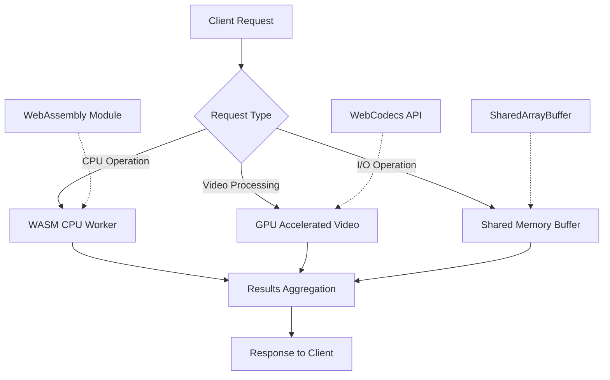
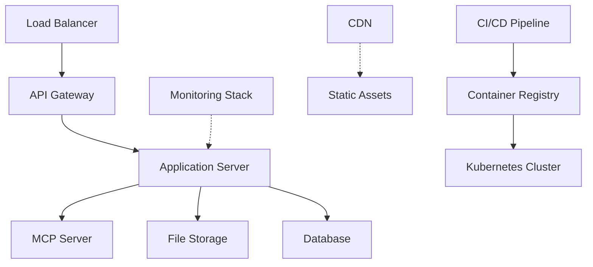

# VideoStorage-8 Phase 2 Development Plan

## Overview

Phase 2 builds upon the consolidated architecture established in Phase 1, focusing on test suite expansion, performance optimizations, and cloud deployment capabilities. The goal is to create a production-ready system with enhanced reliability and scalability.

## Milestone Objectives

### 1. Test Suite Expansion

#### Video Subsystem Integration Tests
- **Video memory mapping tests**: Validate 0x8000-0x9FFF memory range operations
- **Video API endpoint testing**: Full coverage of `/mcp/video/*` endpoints
- **Pixel manipulation validation**: Test setPixel operations with boundary conditions
- **Video frame encoding/decoding**: Cross-browser compatibility tests

#### CPU Integration Tests
- **Interrupt handling tests**: Validate 0xFF00-0xFFFF interrupt vector operations
- **Memory-mapped I/O tests**: Full terminal and video I/O testing
- **Instruction timing tests**: Performance benchmarking for all opcodes
- **Multi-threaded CPU tests**: Concurrent operation validation

#### End-to-End Integration Suite
- **Round-trip data tests**: Assembly → Encode → Decode → Execute cycles
- **Cross-browser compatibility**: WebCodecs API fallback testing
- **Mobile device testing**: Touch interface and performance validation
- **Network resilience tests**: Offline operation and sync capabilities

### 2. Performance Optimizations

#### WebAssembly CPU Emulation (Priority: High)
- **Core CPU logic porting**: Move instruction execution to WebAssembly
- **Memory access optimization**: Direct memory buffer operations
- **Interrupt handling**: Low-latency interrupt processing
- **Performance targets**: 1000+ instructions/second improvement

**Implementation Plan**:
```javascript
// WebAssembly integration structure
import { initWasmCPU } from './js/cpu/cpu-wasm.js';

// Initialize WebAssembly CPU with shared memory
const wasmCPU = await initWasmCPU(sharedMemoryBuffer);
```

#### Advanced Video Processing
- **Hardware acceleration**: GPU-accelerated video encoding/decoding
- **WebCodecs integration**: Modern browser video processing APIs
- **Streaming optimization**: Real-time video processing pipelines
- **Memory optimization**: Zero-copy video buffer operations

#### Memory Management Enhancements
- **SharedArrayBuffer usage**: Cross-worker memory sharing
- **Garbage collection optimization**: Minimize GC pauses during execution
- **Memory pooling**: Reuse buffer allocations for better performance
- **Large data handling**: Streaming for files > 100MB

### 3. Cloud Deployment & DevOps

#### Containerization Strategy
- **Docker multi-stage builds**: Optimized production images
- **Docker Compose stack**: Complete development environment
- **Kubernetes manifests**: Production deployment configuration
- **Container registry**: Automated image building and scanning

#### Cloud Platform Support
- **AWS deployment**: EC2/EKS with load balancing and auto-scaling
- **Google Cloud**: App Engine/Kubernetes Engine integration
- **Azure deployment**: Container instances and AKS support
- **DigitalOcean**: Droplet and managed Kubernetes options

#### DevOps Pipeline
- **CI/CD setup**: GitHub Actions/Azure DevOps/GitLab CI
- **Automated testing**: Integration test execution on pull requests
- **Security scanning**: Container and dependency vulnerability checks
- **Performance monitoring**: APM integration and alerting

#### Infrastructure as Code
- **Terraform modules**: Reusable infrastructure components
- **Ansible playbooks**: Server configuration management
- **Monitoring stack**: Prometheus/Grafana for metrics collection
- **Logging aggregation**: ELK stack for centralized logging

## Technical Architecture Considerations

### Performance Architecture



### Deployment Architecture



## Implementation Timeline

### Month 1-2: Test Suite Completion
- [ ] Complete video subsystem test coverage (80%+)
- [ ] Implement CPU integration test suite
- [ ] Add performance benchmarking framework
- [ ] Cross-browser testing automation

### Month 2-3: WebAssembly Optimization
- [ ] Port core CPU logic to WebAssembly
- [ ] Implement shared memory architecture
- [ ] Performance optimization and benchmarking
- [ ] Fallback handling for unsupported browsers

### Month 3-4: Cloud Infrastructure
- [ ] Container orchestration setup
- [ ] CI/CD pipeline implementation
- [ ] Multi-cloud deployment configurations
- [ ] Monitoring and logging infrastructure

### Month 4-5: Production Readiness
- [ ] Security hardening and penetration testing
- [ ] Load testing and performance optimization
- [ ] Documentation and operational runbooks
- [ ] Production deployment and monitoring

## Success Metrics

### Performance Targets
- **CPU emulation**: 10,000+ instructions/second (baseline: 1,000)
- **Video processing**: Real-time encoding/decoding for HD content
- **Memory usage**: < 100MB baseline, < 50MB optimized
- **Response time**: < 50ms for API endpoints, < 200ms for video operations

### Reliability Targets
- **Uptime**: 99.9% availability in production
- **Error rate**: < 0.1% for critical operations
- **Test coverage**: 90%+ for all subsystems
- **Recovery time**: < 5 minutes for service restoration

### Scalability Targets
- **Concurrent users**: Support 1,000+ simultaneous connections
- **Data processing**: Handle 10GB+ daily video processing
- **Storage growth**: Auto-scaling storage backend
- **Global distribution**: Multi-region deployment support

## Risk Mitigation

### Technical Risks
- **WebAssembly browser support**: Comprehensive fallback strategy
- **Video codec compatibility**: Multiple format support and graceful degradation
- **Memory limitations**: Streaming and chunked processing for large files
- **Performance regression**: Comprehensive benchmarking and monitoring

### Operational Risks
- **Deployment complexity**: Automated deployment pipelines
- **Monitoring gaps**: Comprehensive observability stack
- **Security vulnerabilities**: Regular security audits and updates
- **Data loss**: Multi-region backups and disaster recovery

## Resource Requirements

### Development Team
- **Backend Engineer**: WebAssembly and performance optimization
- **Frontend Engineer**: Video processing and UI enhancements
- **DevOps Engineer**: Cloud infrastructure and automation
- **QA Engineer**: Test automation and quality assurance

### Infrastructure Requirements
- **Development**: Local Docker environment + cloud staging
- **Testing**: Dedicated test environments with load testing tools
- **Production**: Kubernetes cluster with auto-scaling capabilities
- **Monitoring**: Centralized logging and metrics collection

## Conclusion

Phase 2 transforms VideoStorage-8 from a functional prototype into a production-ready platform with enterprise-grade performance, reliability, and scalability. The focus on WebAssembly optimization, comprehensive testing, and cloud-native architecture will enable the system to handle real-world workloads while maintaining the educational and interactive nature of the original project.

---

*Related Files:*
- [Current Architecture](README.md)
- [MCP API Documentation](MCP_API_DOCS.md)
- [Setup & Deployment](SETUP_DEPLOYMENT.md)
- [Performance Benchmarks](test-results.md)